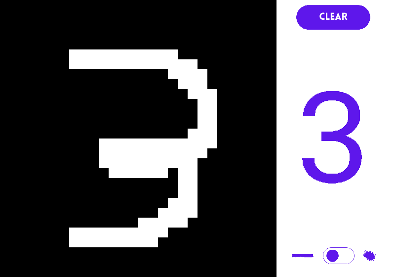

# PaintAI 🖌️

  
  

**A simple app to learn numbers**

Paint AI is built with kind of Technologies😃:  

## Enhancement 🚄

- Add GUI interface (SDL)
- Add sigmoid activation function
- Add entrypoint feature
- Add multi threading tree creation
- Convolution matrix
- Real time number recognized
- Add sound when writing
- Save learnings in a file
- Add bagging (Intances and Features)
- Dataset edited (colors filters, copy...)
- Search for the best hyperparameters.

## How to contribute 🚀

Thank you for your contribution to the open source world !😍

- Contact us by email
- Open a MR

## Support 🛟

If you need assistance or want to ask a question about the app, you are welcome to ask for support in our
Forums.
If you have found a bug, feel free to open a new Issue on Gitlab.

## Licence 📜

The app core is under GPLv3 but be careful the vegetables Images and vegetables data are limited are restricted to
copyright.
